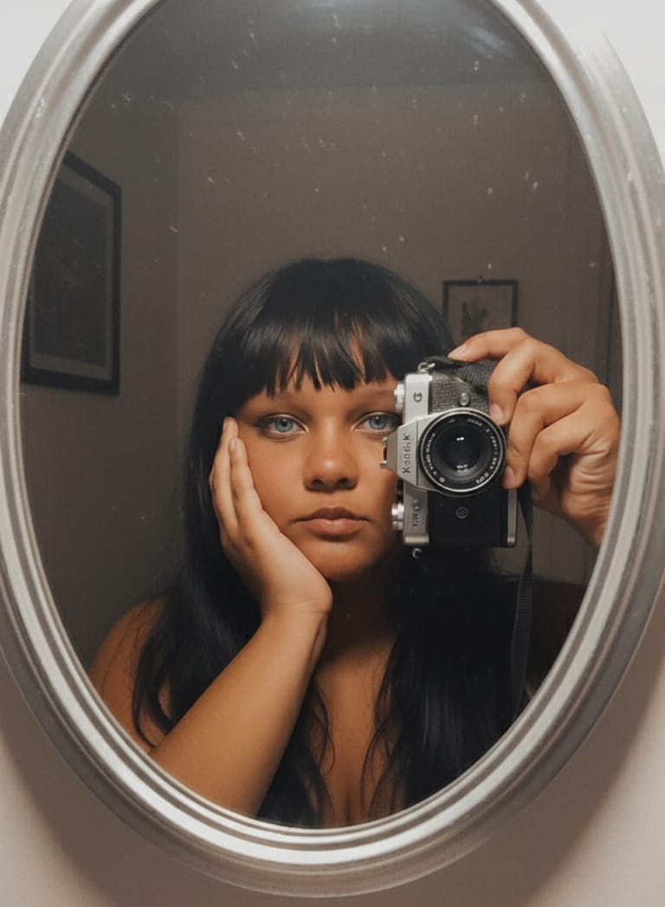
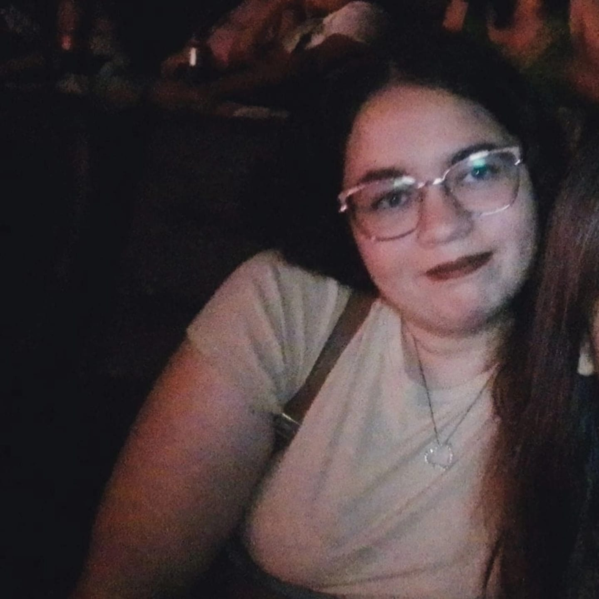

<div align="center">

# 


<!--  -->


</div>

---
<!-- 
# ⚡ SYSTEM STATUS

```diff
+ INITIALIZING VOXEL GAMES...

██████████████████████████████████ 100%

STATUS............. ONLINE

ENGINE............. GDevelop

FlatDesign Vetorial.......... ACTIVE

AI SYSTEM.......... ENABLED

CREATIVITY......... MAXIMUM
```

--- -->
<p align="center">


</p>
<!-- 🌌 ABOUT US -->

> ## 👾 Nós não apenas criamos jogos...

Voxel Games é um estúdio **Indie Game Developer** apaixonado por criar mundos únicos, experiências memoráveis e aventuras que despertam a imaginação.

Nosso foco está em desenvolver jogos utilizando tecnologias modernas combinadas com arte pixel, animações fluidas e criatividade ilimitada.

Nossa missão é transformar ideias em universos vivos.

---


<!-- ✨ Criar jogos únicos

🎮 Desenvolver experiências inesquecíveis

🧠 Misturar IA + Criatividade

🌎 Publicar games para todo o mundo -->
<p align="center">


</p>
<!-- 🚀 OUR MISSION -->
<div align="center">

```
╔════════════════════════════════════════════════════════════╗
║                 ◉  VOXEL GAMES CORE  ◉                    ║
╠════════════════════════════════════════════════════════════╣
║                                                            ║
║  🚀  CREATE IMMERSIVE EXPERIENCES                          ║
║  🎮  BUILD MEMORABLE GAMES                                ║
║  🎨  CRAFT BEAUTIFUL Vetorial ART                         ║
║  🤖  USE AI TO BOOST CREATIVITY                           ║
║  🌎  SHARE STORIES WITH THE WORLD                         ║
║  💜  INSPIRE PLAYERS THROUGH PASSION                      ║
║                                                            ║
╚════════════════════════════════════════════════════════════╝
```

</div>

---

<div align="center">

| 🚀 Innovation | 🎮 Gameplay | 🎨 Vetorial Flat Design Art |
|:-------------:|:----------:|:------------:|
| ⭐⭐⭐⭐⭐ | ⭐⭐⭐⭐⭐ | ⭐⭐⭐⭐⭐ |

| 🤖 Artificial Intelligence | ⚡ Performance | 💜 Creativity |
|:-------------------------:|:-------------:|:-------------:|
| ⭐⭐⭐⭐⭐ | ⭐⭐⭐⭐⭐ | ⭐⭐⭐⭐⭐ |

</div>

---

<!-- <div align="center">

```diff
+ SYSTEM OBJECTIVES

███████████████████████████ 100%
CREATE AMAZING GAMES

████████████████████████░░░ 90%
Vetorial Flat Design ART EXCELLENCE

███████████████████████████ 100%
GAMEPLAY EXPERIENCE

██████████████████████████░ 95%
INNOVATION

███████████████████████████ 100%
PLAYER SATISFACTION
```

</div> -->

---

<div align="center">

> ##  🎮 Por que jogar nossos jogos?

Na **Voxel Games**, acreditamos que um grande jogo vai muito além de gráficos ou mecânicas. Cada projeto nasce da paixão por criar experiências inesquecíveis, capazes de emocionar, desafiar e despertar a imaginação dos jogadores.

Desenvolvemos jogos independentes com dedicação, criatividade e atenção aos mínimos detalhes. Cada pixel, cada animação, cada trilha sonora e cada sistema é pensado para proporcionar momentos únicos e memoráveis.

Nosso objetivo é transportar você para mundos cheios de vida, onde cada aventura conta uma história, cada desafio traz uma conquista e cada personagem possui uma identidade própria.

### ✨ O que torna nossos jogos especiais?

* 🎮 Gameplay divertido, envolvente e acessível.
* 🌍 Mundos ricos em detalhes e personalidade.
* 🎨 Arte em Flat Design Vetorial Art produzida com carinho e qualidade.
* 🦴 Animações fluidas que dão vida aos personagens.
* 💡 Mecânicas criativas que incentivam a exploração.
* 🤖 Desenvolvimento impulsionado por tecnologias modernas e Inteligência Artificial.
* 🚀 Atualizações constantes com novos conteúdos e melhorias.
* ❤️ Jogos feitos por jogadores apaixonados, para jogadores apaixonados.

Mais do que criar jogos, queremos criar lembranças, despertar emoções e proporcionar experiências que permaneçam na memória de quem joga.

---

# 🚀 Nossa Missão

Nossa missão é transformar ideias em mundos incríveis, desenvolvendo jogos independentes que inspirem pessoas, despertem emoções e proporcionem diversão para jogadores de todas as idades.

Buscamos unir criatividade, tecnologia, inovação, arte e paixão para entregar experiências marcantes, sempre priorizando qualidade, originalidade e atenção aos detalhes.

Cada projeto representa nosso compromisso em criar jogos que sejam divertidos, acessíveis e capazes de conquistar jogadores em qualquer lugar do mundo.

---

# 🌎 Nossa Visão

Nossa visão é tornar a **Voxel Games** uma referência no desenvolvimento de jogos independentes, reconhecida pela criatividade, qualidade artística e inovação.

Queremos construir universos únicos, criar personagens memoráveis e desenvolver experiências que inspirem milhões de jogadores ao redor do mundo.

Acreditamos que grandes ideias podem nascer em pequenos estúdios e que a paixão é capaz de transformar sonhos em realidade.

---

# 🎯 Nossas Metas

Estamos constantemente evoluindo e buscando novos desafios. Nossos principais objetivos são:

* 🚀 Desenvolver jogos independentes com qualidade profissional.
* 🌍 Levar nossos jogos para jogadores de diferentes países e plataformas.
* 🎮 Criar experiências divertidas, envolventes e inesquecíveis.
* 🎨 Aperfeiçoar continuamente nossa arte em Vetorial Flat Designer Art e animações.
* 🦴 Utilizar as melhores ferramentas para entregar jogos cada vez melhores.
* 🤖 Integrar Inteligência Artificial aos nossos processos criativos e de desenvolvimento.
* 💡 Inovar constantemente com novas mecânicas, ideias e tecnologias.
* 🤝 Construir uma comunidade forte, participativa e apaixonada pelos nossos jogos.
* 📈 Crescer de forma sustentável, mantendo nossa identidade e nossos valores.
* ❤️ Transformar nossa paixão por desenvolver jogos em experiências que encantem pessoas no mundo inteiro.

---

# 💜 Nosso Compromisso

Na **Voxel Games**, acreditamos que cada jogador merece viver uma experiência única.

Por isso, trabalhamos todos os dias para desenvolver jogos com dedicação, criatividade e excelência, sempre buscando superar expectativas e oferecer aventuras que inspirem, emocionem e divirtam.

Nossa jornada está apenas começando.

E queremos que você faça parte dela.

**Bem-vindo à Voxel Games. Onde cada pixel conta uma história e cada jogo cria uma nova aventura.** 🎮✨


</div>

<p align="center">


</p>

---
<p align="center">


</p>
<!-- # 👨‍🚀 OUR TEAM -->

<div align="center">

<table>
<tr>

<td align="center">


## 👨‍💻 Developer

**`Game Art | Programador`** <br>
**`Game Designer`** <br>
**`CEO & Game Sound`**

</td>

<!-- <td align="center">



## 🎨 Artist

**`Dubladora & Game Art`** <br> **`Game Designer`** 

</td>

<td align="center">



## 🎮 Game Designer

**`Game Designer`** <br> **`Game Sound`** 

</td>

</tr>
</table>

</div> -->

---
<p align="center">


</p>

<div align="center">

## ⚡ DEVELOPMENT ECOSYSTEM

<!-- 

<br><br> -->

| 🛰️ Division | ⚡ Software | 🎯 Purpose |
|:-----------:|:------------|:-----------|
| 🎮 Game Engine | **GDevelop 5** | Gameplay & Development |
| 🎨 Vetorial Flat Design Art | **Inkscape** , **Tiled** |
| 🖌 Vector Graphics | **Inkscape** | UI & Illustrations |
| 🤖 AI Assistant | **ChatGPT • Gemini** | Productivity & Creativity |

<br>

```text
◉ GAME ENGINE .............. READY
◉ PIXEL PIPELINE ........... ONLINE
◉ ANIMATION SYSTEM ......... ACTIVE
◉ AI ASSISTANTS ............ ENABLED
◉ CREATIVE CORE ............ 100%
```

</div>

---
<p align="center">


</p>
<!-- # 💻 TECHNOLOGIES -->

<div align="center">


<p align="center">


</p>
<!-- # 🌌 CYBER CORE -->

<!-- <div align="center">


</div> -->
# 👾 Cyber Snake

<div align="center">


</div>

---
<p align="center">


</p>
<!-- # 🎮 GAME DEVELOPMENT -->
<p align="center">

<!--  -->

</p>

```text
██████╗  ██████╗ ██╗  ██╗███████╗██╗          ██████╗  █████╗ ███╗   ███╗███████╗███████╗
██╔══██╗██╔═══██╗╚██╗██╔╝██╔════╝██║         ██╔════╝ ██╔══██╗████╗ ████║██╔════╝██╔════╝
██████╔╝██║   ██║ ╚███╔╝ █████╗  ██║         ██║  ███╗███████║██╔████╔██║█████╗  ███████╗
██╔══██╗██║   ██║ ██╔██╗ ██╔══╝  ██║         ██║   ██║██╔══██║██║╚██╔╝██║██╔══╝  ╚════██║
██████╔╝╚██████╔╝██╔╝ ██╗███████╗███████╗    ╚██████╔╝██║  ██║██║ ╚═╝ ██║███████╗███████║
╚═════╝  ╚═════╝ ╚═╝  ╚═╝╚══════╝╚══════╝     ╚═════╝ ╚═╝  ╚═╝╚═╝     ╚═╝╚══════╝╚══════╝

══════════════════════════════════════════════════════════════════════════════════════════════

PROGRAMMING           ◢████████████████████░░░░░◣ 85%
Vetorial Flat Design  ◢██████████████████████░░░◣ 90%
ANIMATION             ◢████████████████████░░░░░◣ 85%
GDevelop 5            ◢█████████████████████░░░░◣ 88%
AI TOOLS              ◢███████████████████████░░◣ 95%
CREATIVITY            ◢█████████████████████████◣100%

══════════════════════════════════════════════════════════════════════════════════════════════

◉ STATUS ........ ONLINE
◉ STUDIO ........ VOXEL GAMES
◉ ENGINE ........ GDevelop
◉ STYLE ......... Vetorial ART
◉ AI ............ ACTIVE
◉ TARGET ........ NEXT LEVEL
```

---
<p align="center">


</p>
<!-- # 🌐 SOCIAL NETWORK -->

<div align="center">

<a href="#">

</a>

<a href="#">

</a>

<a href="#">

</a>

<a href="#">

</a>

<a href="#">

</a>

<a href="#">

</a>

</div>

---
<p align="center">


</p>
<!-- # 💜 CYBER QUOTE -->

<div align="center">

> ### "Games são mais do que código.
>
> ### São mundos esperando para serem explorados."

</div>

---

<!-- <div align="center">


</div>
<p align="center"> -->


<p align="center">


</p>
